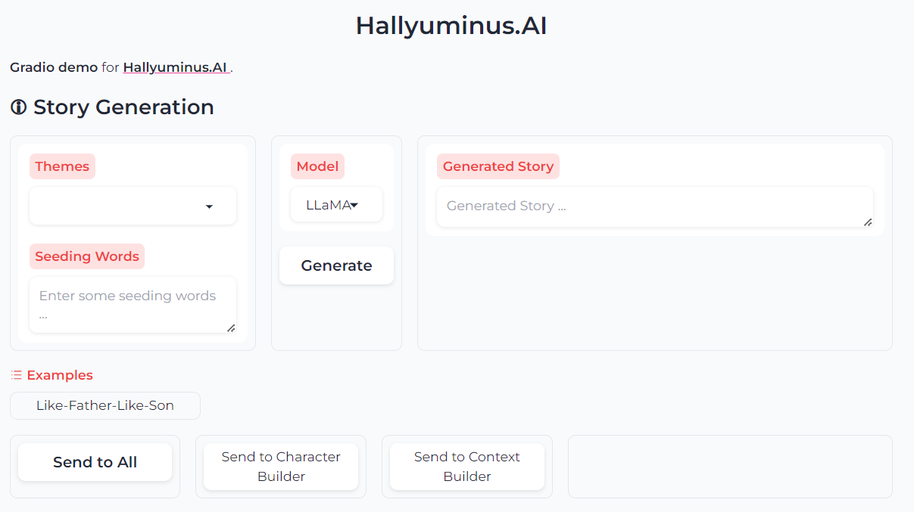
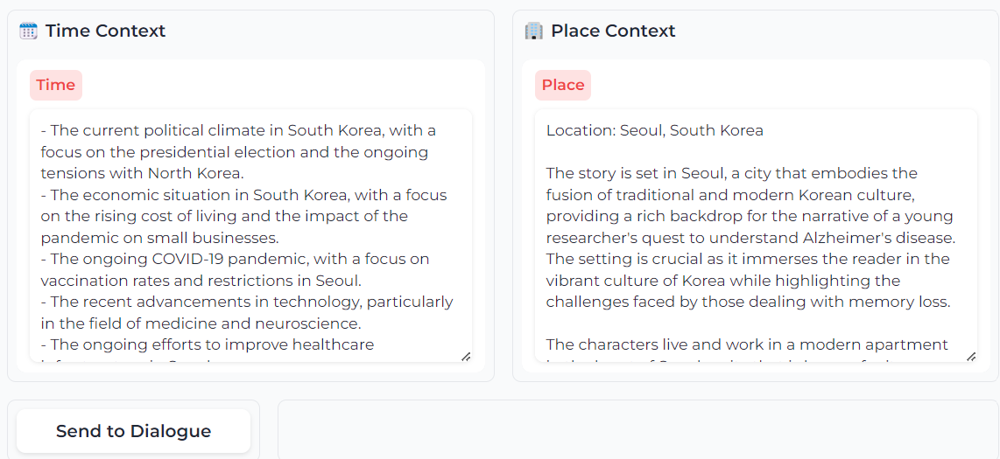
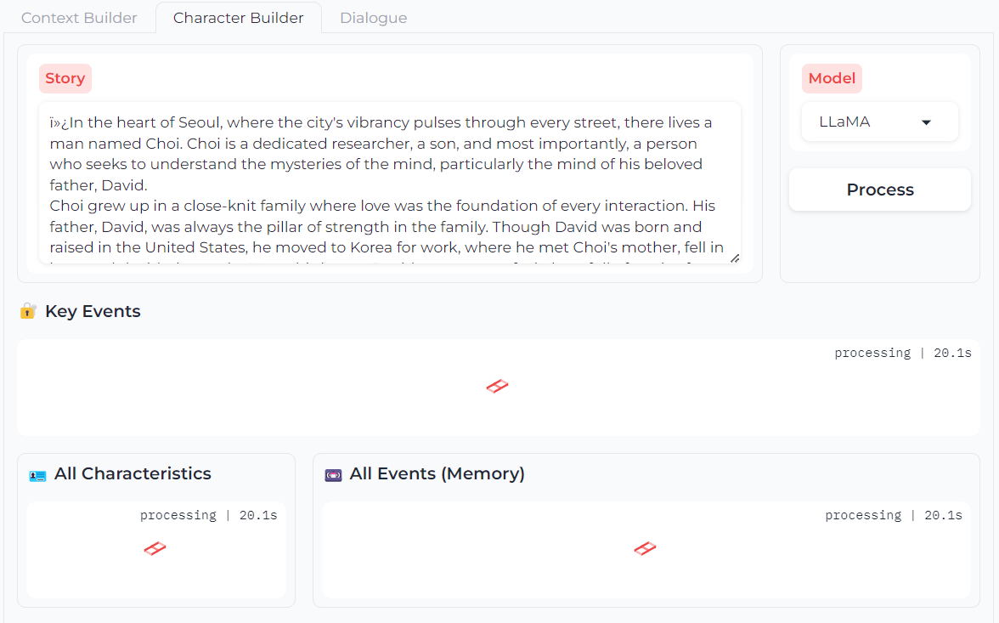
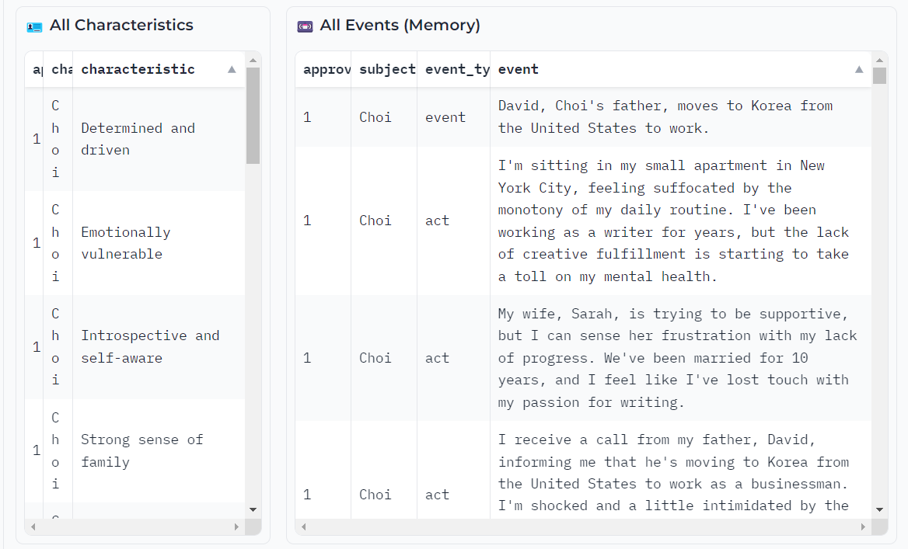
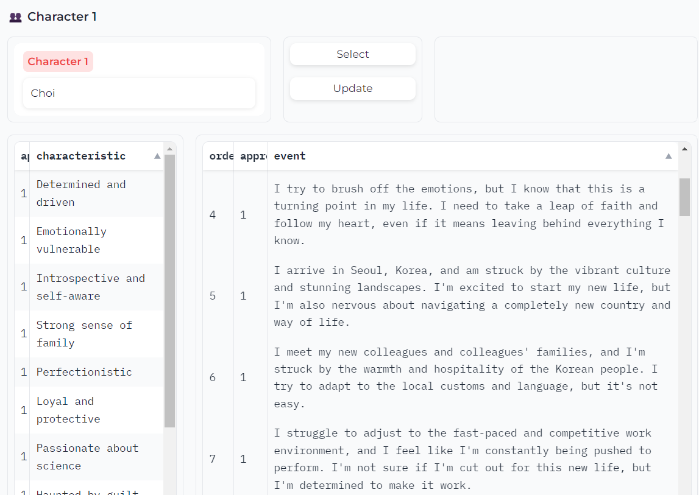
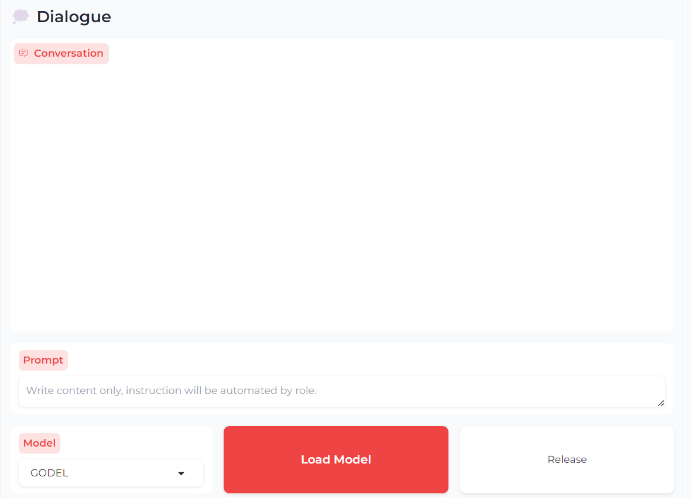
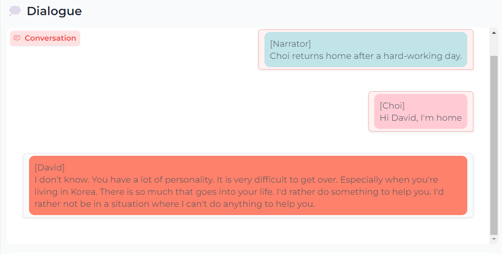

# Hallyuminus.AI

[Illuminus.ai] **Dialogue System for screenwriting K-drama.**

- This approach targets on using **open-sourced sSsM** (several Small-sized Model), not all-in-1 closed-sourced lLLM (luxurious Large Language Model, like ChatGPT, Gemini, etc.), to simulate participants in a dialogue, including the **narrator** and **characters**.

**Note:** 
- [Character.AI](https://character.ai/) seems very capable of imitating character's characteristics. However, in my experience, it is very easy to manipulate the conversation with the trained bots, so I feel bored in a very short time.

- [Dialogue Model](https://huggingface.co/microsoft/GODEL-v1_1-base-seq2seq) is NOT capable of responding as a participant in a dialogue. It should be named as **Answering Model**. Hence, the result from these pretrained QnaModel doesn't sound good.
--------------------------
## To-Do List

- [x] GUI
- [x] **Character** Builder
- [x] **Relation** Builder
- [x] **Context** Builder
- [x] **Memory** Manager (naïve)
- [ ] **Emotion** Manager
- [x] **Dialogue** Manager
- [ ] **Language** Manager

--------------------------
## Future Improvements

- [ ] **Emotion**-triggered **Memory** Manager (RAG + Graph)
- [ ] Train **LoRA** as **Character** and **Context** Adaptation
- [ ] Finetune **MLM** for customized tasks
- [ ] Voice Dialogue (T2S, S2T)

--------------------------
## Dataset

--------------------------
## Getting started
This code was tested with:

* Windows 11
* NVIDIA GeForce RTX 3060 - 6144 MiB
* Python 3.10.6
* CUDA 12.1

Setup environment:

```shell
pip install -q -r requirements.txt
```

#### Download **Checkpoints**

- [Natsumura Storytelling Roleplay LLaMA](https://huggingface.co/tohur/natsumura-storytelling-rp-1.0-llama-3.1-8b-GGUF/blob/main/natsumura-storytelling-rp-1.0-llama-3.1-8B.Q2_K.gguf) to local file `./checkpoints/natsumura-storytelling-rp-1.0/llama-3.1-8B.Q2_K.gguf`

- [Llama-3.2-1B-Instruct](https://huggingface.co/hugging-quants/Llama-3.2-1B-Instruct-Q8_0-GGUF/blob/main/llama-3.2-1b-instruct-q8_0.gguf) to local file `./checkpoints/Llama-3.2-1B-Instruct/llama-3.2-1b-instruct-q8_0.gguf`

- [GODEL-v11-base](https://huggingface.co/microsoft/GODEL-v1_1-base-seq2seq/tree/main) to local folder `./checkpoints/GODEL-v1_1-base-seq2seq`

- (⚠️ **Not good enough**) [KoGPT](https://huggingface.co/psyche/kogpt/tree/main) to local folder `./checkpoints/kogpt`

--------------------------
## User Guide

#### Run **Gradio UI**
```shell
python -m app.main
```
- Before going to a dialogue, a good story needs a solid `Context Background` and `Character`.

#### **Story** Generation

- User can generate new stories from selected `themes` and `seeding words`. Else, simply select the story from **Examples**



- Click `Send to All` to share the story to other tabs

#### **Context** Builder

- LLM will generate `contextual information` relating to `time` and `place`



- User should revise and edit these information before click `Send to Dialogue`

#### **Character** Builder

- It can take more than 1 minute for LLM to do `Key Information Extraction` to find `Characteristics` and `Key Events` for all characters (`characters` are found by LLM, but sometimes, ⚠️ it results as `David (Choi's father)` which is not wanted!)



- `All Events` are enriched by LLM based on `Key Events` (which are described in the original story). These synthesized events can make non-sense, hence, it requires user to edit



- User should insert name of `Character 1` and `Character 2`, then, edit their events for more logically



- Lastly, click `Send to Dialogue`

#### **Dialogue** Generation

- Firstly, user should click `Load Model` 



- User can become any of 3 roles: `Narrator`, `Character 1` or `Character 2` by inserting dialogue / narration and click `Send as {role}`

- User can send **empty prompt** for LLM generating dialogue / narration

- **Dialogue Manager** will automatically update `Character Memory` with new dialogue. `User's prompt` will be displayed on the right side, while `LLM's prompt` is on the left



- As I admitted from the beginning, the bot is **Answering Model**, not ~~Dialogue Model~~, hence, the result is very bad. 

--------------------------
## References
[Story Generation](https://github.com/yingpengma/Awesome-Story-Generation)
